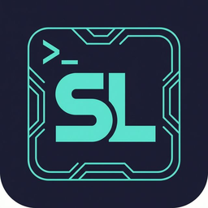

<p align="center">
  <a href="https://github.com/SalyyS1/SLTerm">
    
  </a>
</p>

<h1 align="center">SLTerm</h1>

<p align="center">
  <strong>Open-Source Modern Terminal by Salyvn</strong>
</p>

<p align="center">
  <a href="https://github.com/SalyyS1/SLTerm/releases"></a>
  <a href="https://github.com/SalyyS1/SLTerm/blob/main/LICENSE"></a>
  <a href="https://github.com/SalyyS1/SLTerm/releases"></a>
</p>

---

SLTerm is a modern, feature-rich terminal built on Electron. It combines the power of a traditional terminal with a graphical workspace — file previews, web browsing, and rich customization — all in one window.

## ✨ Features

- **Drag & Drop Workspace** — Organize terminal blocks, editors, and web browsers in a flexible tiled layout
- **Built-in Editor** — Edit local and remote files with syntax highlighting
- **Rich File Previews** — Markdown, images, video, PDFs, CSVs, directories
- **One-Click SSH Connections** — Full terminal and file system access to remote servers
- **🌐 i18n Support** — English & Vietnamese, with easy extension to more languages
- **🎨 Theming** — 18 built-in themes, custom backgrounds, transparency, and blur effects
- **Command Blocks** — Isolate and monitor individual commands
- **`wsh` CLI** — Powerful command system for managing your workspace from the terminal
- **NSIS Installer** — Professional Windows installer with custom install directory

## 📥 Installation

### Windows

Download the latest installer from [**Releases**](https://github.com/SalyyS1/SLTerm/releases):

| File                     | Description                  |
| ------------------------ | ---------------------------- |
| `SLTerm-win32-x64-*.exe` | NSIS Installer (recommended) |
| `SLTerm-win32-x64-*.zip` | Portable ZIP                 |

### Minimum Requirements

- Windows 10 1809 or later (x64)
- macOS 11 or later (arm64, x64)
- Linux glibc-2.28+ (Debian 10, Ubuntu 20.04, RHEL 8)

## 🛠️ Building from Source

```bash
# Clone
git clone https://github.com/SalyyS1/SLTerm.git
cd SLTerm

# Install dependencies
npm install

# Development
npm run dev

# Production build
npm run build:prod

# Build installer (Windows)
npx electron-builder --win --x64 --config electron-builder.config.cjs
```

See [BUILD.md](BUILD.md) for detailed instructions.

## 🌐 Internationalization (i18n)

SLTerm supports multiple languages:

| Language   | Status      |
| ---------- | ----------- |
| English    | ✅ Complete |
| Tiếng Việt | ✅ Complete |

Switch languages instantly in **Settings → Language** — no restart required.

To add a new language, create a JSON file in `frontend/i18n/locales/` following the structure of `en.json`.

## 📁 Project Structure

```
SLTerm/
├── emain/          # Electron main process
├── frontend/       # React frontend
│   ├── app/        # Main application components
│   ├── i18n/       # Internationalization (locales)
│   └── logos/      # App logos
├── pkg/            # Go backend packages
├── cmd/            # Go entry points (wavesrv, wsh)
├── assets/         # Branding assets
└── build/          # Build resources (icons)
```

## 📝 License

SLTerm is licensed under the [Apache-2.0 License](LICENSE).

**Based on [Wave Terminal](https://github.com/wavetermdev/waveterm)** — forked and customized by [Salyvn](https://github.com/SalyyS1).

## 🙏 Acknowledgements

See [ACKNOWLEDGEMENTS.md](ACKNOWLEDGEMENTS.md) for the full list of dependencies and credits.
