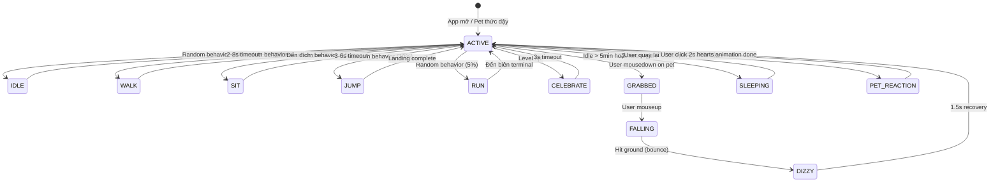

# 🎨 DESIGN: SLTerm Vibe System — Pet + Discord RPC

Ngày tạo: 2026-02-28
Dựa trên: [BRIEF.md](../BRIEF.md) + [Plan](../plans/260228-1751-vibe-system/plan.md)

---

## 1. Cách Lưu Thông Tin (Data Models)

### 1.1. Sơ Đồ Tổng Quan

```
┌──────────────────────────────────────────────────────────┐
│  🐣 PET INSTANCE (Con pet đang nuôi)                    │
│  ├── ID (mã duy nhất)                                   │
│  ├── PetID (loại pet: pikachu, bulbasaur...)             │
│  ├── Name (tên hiển thị)                                 │
│  ├── Level (1-10)                                        │
│  ├── XP / XPToNext / Progress (0-100%)                   │
│  ├── Mood (happy/neutral/sad/hungry/sleepy)              │
│  ├── State (ACTIVE/IDLE/SLEEPING/CELEBRATING/GRABBED)    │
│  ├── Position {x, y} (vị trí trên terminal)             │
│  ├── SpawnedAt (khi nào được tạo)                        │
│  └── TotalPlaytime (tổng giờ chơi)                       │
└───────────────────────────┬──────────────────────────────┘
                            │ thuộc về 1 player
                            ▼
┌──────────────────────────────────────────────────────────┐
│  👤 PLAYER PROFILE (Hồ sơ người chơi)                   │
│  ├── ActivePetID (pet đang nuôi)                         │
│  ├── CompletedPets[] (pet đã evolve xong)                │
│  ├── StreakDays (chuỗi ngày liên tiếp)                   │
│  ├── LastActiveDate                                      │
│  ├── TotalFocusTime                                      │
│  ├── TotalCommands                                       │
│  ├── Achievements[] (thành tựu đã mở)                    │
│  └── CustomDialogues[] (câu thoại tự custom)             │
└──────────────────────────────────────────────────────────┘

┌──────────────────────────────────────────────────────────┐
│  🎮 SESSION DATA (Phiên làm việc - tạm thời)            │
│  ├── StartedAt (bắt đầu khi nào)                        │
│  ├── ActiveTime (thời gian thực sự code)                 │
│  ├── CommandCount (số lệnh đã chạy session này)          │
│  ├── IdleSince (idle từ khi nào)                         │
│  ├── CurrentProject (tên project đang mở)                │
│  └── DiscordConnected (Discord có đang kết nối không)    │
└──────────────────────────────────────────────────────────┘

┌──────────────────────────────────────────────────────────┐
│  📦 PET CATALOGUE (Danh sách pet có sẵn - read only)    │
│  ├── ID (pikachu, bulbasaur...)                          │
│  ├── Name (tên hiển thị)                                 │
│  ├── SpriteSheet (đường dẫn sprite)                      │
│  ├── FrameMap (animation frames)                         │
│  ├── Size {w, h}                                         │
│  ├── Type (pokemon / shimeji / custom)                   │
│  └── DiscordAssetKey (icon trên Discord)                 │
└──────────────────────────────────────────────────────────┘
```

### 1.2. Go Struct Definitions (`pkg/petengine/types.go`)

```go
package petengine

import "time"

// PetInstance — con pet đang được nuôi
type PetInstance struct {
    ID            string    `json:"id"`
    PetID         string    `json:"petId"`
    Name          string    `json:"name"`
    Level         int       `json:"level"`
    XP            int       `json:"xp"`
    XPToNext      int       `json:"xpToNext"`
    Progress      float64   `json:"progress"`      // 0.0 - 1.0
    Mood          string    `json:"mood"`           // happy, neutral, sad, hungry, sleepy
    State         string    `json:"state"`          // ACTIVE, IDLE, SLEEPING, CELEBRATING, GRABBED
    Hunger        float64   `json:"hunger"`         // 0.0 (sated) - 1.0 (starving)
    Energy        float64   `json:"energy"`         // 0.0 (exhausted) - 1.0 (full)
    SpawnedAt     time.Time `json:"spawnedAt"`
    TotalPlaytime int64     `json:"totalPlaytime"`  // seconds
}

// PlayerProfile — hồ sơ người chơi
type PlayerProfile struct {
    ActivePetID    string            `json:"activePetId"`
    CompletedPets  []string          `json:"completedPets"`
    StreakDays     int               `json:"streakDays"`
    LastActiveDate string            `json:"lastActiveDate"` // YYYY-MM-DD
    TotalFocusTime int64            `json:"totalFocusTime"`  // seconds
    TotalCommands  int              `json:"totalCommands"`
    Achievements   []string          `json:"achievements"`
    CustomDialogues []CustomDialogue `json:"customDialogues,omitempty"`
}

// CustomDialogue — câu thoại user tự thêm
type CustomDialogue struct {
    ID       string `json:"id"`
    TextVI   string `json:"textVi"`
    TextEN   string `json:"textEn"`
    Mood     string `json:"mood,omitempty"`     // chỉ hiện khi mood này, empty = mọi mood
    TimeFrom int    `json:"timeFrom,omitempty"` // chỉ hiện từ giờ nào (0-23), 0 = mọi lúc
    TimeTo   int    `json:"timeTo,omitempty"`
}

// SessionData — phiên làm việc hiện tại (không persist)
type SessionData struct {
    StartedAt        time.Time `json:"startedAt"`
    ActiveTime       int64     `json:"activeTime"`       // seconds
    CommandCount     int       `json:"commandCount"`
    IdleSince        time.Time `json:"idleSince"`
    IsIdle           bool      `json:"isIdle"`
    CurrentProject   string    `json:"currentProject"`
    DiscordConnected bool      `json:"discordConnected"`
}

// PetCatalogueEntry — thông tin 1 loại pet
type PetCatalogueEntry struct {
    ID              string          `json:"id"`
    Name            string          `json:"name"`
    SpriteSheet     string          `json:"spriteSheet"`
    FrameWidth      int             `json:"frameWidth"`
    FrameHeight     int             `json:"frameHeight"`
    Animations      map[string]AnimDef `json:"animations"`
    Type            string          `json:"type"`            // pokemon, shimeji, custom
    DiscordAssetKey string          `json:"discordAssetKey"`
}

// AnimDef — định nghĩa 1 animation
type AnimDef struct {
    Frames []int `json:"frames"`
    FPS    int   `json:"fps"`
    Loop   bool  `json:"loop"`
}

// XP and leveling constants
const (
    MaxLevel          = 10
    XPPerMinute       = 2
    XPPerCommand      = 5
    XPPerFocusSession = 50
    XPStreakMultiplier = 25
    IdleTimeoutSec    = 300 // 5 minutes
    SaveIntervalSec   = 30
)

// Level formula: XPToNext = 100 * level * 1.5
func CalcXPToNext(level int) int {
    return int(float64(100*level) * 1.5)
}
```

### 1.3. TypeScript Types (`frontend/app/view/pet/pet-types.ts`)

```typescript
// Mirror of Go structs for frontend

export interface PetInstance {
  id: string;
  petId: string;
  name: string;
  level: number;
  xp: number;
  xpToNext: number;
  progress: number; // 0-1
  mood: PetMood;
  state: PetState;
  hunger: number;
  energy: number;
  spawnedAt: string;
  totalPlaytime: number;
}

export type PetMood = "happy" | "neutral" | "sad" | "hungry" | "sleepy";
export type PetState = "ACTIVE" | "IDLE" | "SLEEPING" | "CELEBRATING" | "GRABBED" | "FALLING";

export interface PlayerProfile {
  activePetId: string;
  completedPets: string[];
  streakDays: number;
  lastActiveDate: string;
  totalFocusTime: number;
  totalCommands: number;
  achievements: string[];
  customDialogues?: CustomDialogue[];
}

export interface CustomDialogue {
  id: string;
  textVi: string;
  textEn: string;
  mood?: PetMood;
  timeFrom?: number;
  timeTo?: number;
}

export interface SessionData {
  startedAt: string;
  activeTime: number;
  commandCount: number;
  isIdle: boolean;
  currentProject: string;
  discordConnected: boolean;
}

export interface PetCatalogueEntry {
  id: string;
  name: string;
  spriteSheet: string;
  frameWidth: number;
  frameHeight: number;
  animations: Record<string, AnimDef>;
  type: "pokemon" | "shimeji" | "custom";
  discordAssetKey: string;
}

export interface AnimDef {
  frames: number[];
  fps: number;
  loop: boolean;
}

// Frontend-only types
export interface PetPosition {
  x: number;
  y: number;
  facing: "left" | "right";
  velocityX: number;
  velocityY: number;
}

export type PetBehavior =
  | "WALK"
  | "RUN"
  | "JUMP"
  | "IDLE"
  | "SLEEP"
  | "CELEBRATE"
  | "SIT"
  | "GRABBED"
  | "FALL"
  | "DIZZY"
  | "PET";
```

---

## 2. RPC Contracts (Cách Frontend nói chuyện với Go Backend)

SLTerm dùng pattern `WshServer` với WebSocket. Mỗi command = 1 hàm Go.

### 2.1. Pet Commands (thêm vào `wshserver.go`)

| Command                 | Input              | Output                | Mô tả                         |
| ----------------------- | ------------------ | --------------------- | ----------------------------- |
| `PetGetState`           | —                  | `PetInstance`         | Lấy trạng thái pet hiện tại   |
| `PetGetProfile`         | —                  | `PlayerProfile`       | Lấy hồ sơ người chơi          |
| `PetGetSession`         | —                  | `SessionData`         | Lấy thông tin phiên           |
| `PetSelectPet`          | `{petId: string}`  | `PetInstance`         | Chọn/đổi pet                  |
| `PetInteract`           | `{action: string}` | `PetInstance`         | "pet" / "feed" → tăng mood    |
| `PetAddXP`              | `{amount: int}`    | `PetInstance`         | Thêm XP (testing/bonus)       |
| `PetUpdateState`        | `{state: string}`  | `PetInstance`         | Đổi trạng thái (UI → backend) |
| `PetGetCatalogue`       | —                  | `[]PetCatalogueEntry` | Danh sách pet có sẵn          |
| `PetSetCustomDialogues` | `[]CustomDialogue` | —                     | Lưu câu thoại custom          |
| `PetGetDialogue`        | `{mood,hour}`      | `{text,lang}`         | Lấy câu thoại ngẫu nhiên      |

### 2.2. Go Implementation Pattern

```go
// Thêm vào pkg/wshrpc/wshserver/wshserver.go
// Theo đúng pattern hiện có của WshServer

func (ws *WshServer) PetGetStateCommand(ctx context.Context) (*petengine.PetInstance, error) {
    return petengine.GetCurrentPet()
}

func (ws *WshServer) PetGetProfileCommand(ctx context.Context) (*petengine.PlayerProfile, error) {
    return petengine.GetProfile()
}

func (ws *WshServer) PetSelectPetCommand(ctx context.Context, data wshrpc.PetSelectData) (*petengine.PetInstance, error) {
    return petengine.SelectPet(data.PetID)
}

func (ws *WshServer) PetInteractCommand(ctx context.Context, data wshrpc.PetInteractData) (*petengine.PetInstance, error) {
    return petengine.Interact(data.Action) // "pet", "feed"
}

func (ws *WshServer) PetAddXPCommand(ctx context.Context, data wshrpc.PetXPData) (*petengine.PetInstance, error) {
    return petengine.AddXP(data.Amount)
}
```

### 2.3. RPC Type Definitions (thêm vào `wshrpctypes.go`)

```go
// Pet RPC data types
type PetSelectData struct {
    PetID string `json:"petId"`
}

type PetInteractData struct {
    Action string `json:"action"` // "pet", "feed"
}

type PetXPData struct {
    Amount int `json:"amount"`
}

type PetDialogueRequest struct {
    Mood string `json:"mood"`
    Hour int    `json:"hour"` // 0-23 local hour
    Lang string `json:"lang"` // "vi", "en"
}

type PetDialogueResponse struct {
    Text string `json:"text"`
    Type string `json:"type"` // "random", "health", "levelup", "custom"
}
```

### 2.4. Frontend RPC Calls (thêm vào `wshclientapi.ts`)

```typescript
// Auto-generated from Go — thêm pet commands

PetGetStateCommand(): Promise<PetInstance>
PetGetProfileCommand(): Promise<PlayerProfile>
PetGetSessionCommand(): Promise<SessionData>
PetSelectPetCommand(data: { petId: string }): Promise<PetInstance>
PetInteractCommand(data: { action: string }): Promise<PetInstance>
PetAddXPCommand(data: { amount: number }): Promise<PetInstance>
PetGetCatalogueCommand(): Promise<PetCatalogueEntry[]>
PetSetCustomDialoguesCommand(data: CustomDialogue[]): Promise<void>
PetGetDialogueCommand(data: { mood: string; hour: number; lang: string }): Promise<{ text: string; type: string }>
```

---

## 3. Frontend Component Architecture

### 3.1. Component Tree

```
AppInner
└── TabContent
    └── TerminalBlock
        ├── Term (xterm.js — existing)
        ├── PetOverlay ★ NEW
        │   ├── <canvas> (sprite rendering)
        │   ├── SpeechBubble (dialogue popup)
        │   │   └── ZZZAnimation (sleep particles)
        │   └── HeartsParticle (vuốt ve effect)
        ├── PetHUD ★ NEW
        │   ├── LevelBadge
        │   ├── XPBar
        │   └── StreakCounter
        └── TermSticker (existing)

Settings (WaveConfig)
└── SettingsVisualContent
    ├── ... (existing categories)
    └── SettingsCategory "Pet" ★ NEW
        ├── ToggleSetting pet:enabled
        ├── SliderSetting pet:size
        ├── SliderSetting pet:dialogueFrequency
        ├── ToggleSetting pet:healthReminders
        ├── PetSelectorButton → PetSelector modal
        ├── CustomDialogueEditor
        └── ToggleSetting discord:enabled
```

### 3.2. Jotai State Atoms (`pet-model.ts`)

```typescript
// Core pet state (synced with Go backend)
const petInstanceAtom = atom<PetInstance | null>(null);
const playerProfileAtom = atom<PlayerProfile | null>(null);
const sessionDataAtom = atom<SessionData | null>(null);
const petCatalogueAtom = atom<PetCatalogueEntry[]>([]);

// Frontend-only state (UI rendering)
const petPositionAtom = atom<PetPosition>({ x: 100, y: 0, facing: "right", velocityX: 0, velocityY: 0 });
const petBehaviorAtom = atom<PetBehavior>("IDLE");
const currentAnimationAtom = atom<string>("idle");
const speechBubbleAtom = atom<{ text: string; visible: boolean }>({ text: "", visible: false });
const isGrabbedAtom = atom<boolean>(false);

// Derived atoms
const petEnabledAtom = atom((get) => get(settingsAtom)["pet:enabled"] ?? true);
const petLevelAtom = atom((get) => get(petInstanceAtom)?.level ?? 1);
const petProgressAtom = atom((get) => get(petInstanceAtom)?.progress ?? 0);
```

---

## 4. State Machine (Luồng trạng thái Pet)



---

## 5. Dialogue System Design

### 5.1. Dialogue Categories & Priority

| Priority    | Category        | Trigger               | Cooldown              |
| ----------- | --------------- | --------------------- | --------------------- |
| 1 (highest) | Level Up        | XP reaches threshold  | Once per level        |
| 2           | Health Reminder | Time-based UTC check  | Per reminder interval |
| 3           | Mood Reaction   | Mood change event     | 60s                   |
| 4           | Custom User     | Random from user pool | 90s                   |
| 5 (lowest)  | Random Cute     | Periodic timer        | 30-90s random         |

### 5.2. Health Reminder Schedule

```
┌────────────────────────────────────────────────────────┐
│ REMINDER    │ TRIGGER              │ INTERVAL │ ICON   │
├─────────────┼──────────────────────┼──────────┼────────┤
│ Đi ngủ     │ 23:00-05:00 local    │ 30 min   │ 🌙     │
│ Ăn trưa    │ 12:00-13:00 local    │ 20 min   │ 🍚     │
│ Ăn tối     │ 18:00-19:00 local    │ 20 min   │ 🍜     │
│ Uống nước  │ Always               │ 90 min   │ 💧     │
│ Nghỉ mắt   │ Always               │ 45 min   │ 👀     │
│ Đứng dậy   │ Active > 2h          │ 120 min  │ 🧍     │
└─────────────┴──────────────────────┴──────────┴────────┘
```

### 5.3. Dialogue Data Files

**`frontend/i18n/locales/vi/pet.json`:**

```json
{
  "dialogue": {
    "happy": ["Code xịn quá đại ca!", "Hôm nay vui ghê!", "Em cổ vũ đại ca! 💪", "Đại ca ngon lành quá!"],
    "neutral": ["Hmm...", "Code gì vậy ta?", "...", "Đại ca ơi~"],
    "sad": ["Vuốt ve em đi mà...", "Em buồn quá...", "Đại ca bỏ rơi em rồi 😢"],
    "hungry": ["Em đói rồi, nghỉ ăn đi mà!", "Bụng em kêu rồi nè 🍕", "Cho em ăn đê đại ca!"],
    "sleepy": ["Mắt em díp lại rồi...", "Zzzz...", "Em buồn ngủ quá..."],
    "grabbed": ["Aaaa đặt em xuống!", "Wheee~", "Chóng mặt quá!", "Em sợ cao!"],
    "petted": ["Hehe cưng quá~", "Em thích lắm!", "Nữa đi nữa đi! ❤️"],
    "levelup": ["LEVEL UP! Em lên Lv.{level} rồi nè! 🎉", "Yay! Lên level! Cảm ơn đại ca! ✨"]
  },
  "health": {
    "sleep": [
      "3h sáng rồi đại ca ơi, ngủ đi mà...",
      "Khuya rồi, mai code tiếp nha~",
      "Em buồn ngủ quá, {hour}h rồi nè..."
    ],
    "lunch": ["Giờ ăn trưa rồi, nghỉ tay ăn cơm đi nào!", "Ăn gì chưa đại ca?"],
    "dinner": ["Ăn tối chưa đại ca?", "Bữa tối rồi, nghỉ tay đi nào!"],
    "water": ["Uống nước đi đại ca, đừng khô héo!", "💧 Hydrate time!"],
    "eyes": ["Nhìn xa 20 giây cho mắt nghỉ ngơi nha~", "👀 Nghỉ mắt tí đi đại ca!"],
    "standup": ["Đứng dậy vận động tí đi nào!", "Ngồi lâu quá rồi, giãn cơ đi~"]
  }
}
```

---

## 6. Discord Presence Design

### 6.1. IPC Flow

```
┌───────────┐      ┌──────────────┐      ┌─────────┐
│ Pet Engine│──────▶│ Presence     │──────▶│ Discord │
│ (events)  │      │ Builder (Go) │ IPC   │ Client  │
└───────────┘      └──────────────┘      └─────────┘
     │                    │
     │ onLevelUp          │ debounce 15s
     │ onStateChange      │ only if changed
     │ onProjectChange    │
```

### 6.2. Presence Layout Map

```
┌──────────────────────────────────────┐
│  🎮 SLTerm                          │
│                                      │
│  Details: "Coding: my-project"       │   ← project detection
│  State:   "Pikachu ⚡ Lv.7 • 78%"    │   ← pet info
│                                      │
│  [🖼️ theme_tokyo_neon] [🐣 pikachu]  │   ← large/small image
│  ⏱️ 02:15:30 elapsed                 │   ← session timer
└──────────────────────────────────────┘
```

---

## 7. Settings Schema

Thêm vào `schema/settings.json`:

```json
{
  "pet:enabled": { "type": "boolean", "default": true },
  "pet:size": { "type": "number", "default": 0.5, "min": 0.3, "max": 1.0 },
  "pet:speed": { "type": "number", "default": 0.5, "min": 0.1, "max": 1.0 },
  "pet:dialogueFrequency": { "type": "number", "default": 0.5, "min": 0, "max": 1.0 },
  "pet:healthReminders": { "type": "boolean", "default": true },
  "discord:enabled": { "type": "boolean", "default": false },
  "discord:showProject": { "type": "boolean", "default": true },
  "discord:showPet": { "type": "boolean", "default": true }
}
```

---

## 8. File Map (Files to Create/Modify)

### NEW Files:

| Path                                     | Purpose                |
| ---------------------------------------- | ---------------------- |
| `pkg/petengine/types.go`                 | Go struct definitions  |
| `pkg/petengine/petengine.go`             | XP, level, mood logic  |
| `pkg/petengine/petstore.go`              | JSON persistence       |
| `pkg/petengine/session.go`               | Session tracking       |
| `pkg/petengine/dialogue.go`              | Dialogue engine        |
| `pkg/discordrpc/discordrpc.go`           | Discord IPC client     |
| `pkg/discordrpc/presence.go`             | Presence state builder |
| `frontend/app/view/pet/pet-overlay.tsx`  | Canvas renderer        |
| `frontend/app/view/pet/pet-overlay.scss` | Overlay styles         |
| `frontend/app/view/pet/pet-hud.tsx`      | HUD (level, XP)        |
| `frontend/app/view/pet/pet-selector.tsx` | Pet selection UI       |
| `frontend/app/view/pet/pet-model.ts`     | Jotai atoms            |
| `frontend/app/view/pet/pet-behaviors.ts` | AI behavior engine     |
| `frontend/app/view/pet/pet-dialogue.ts`  | Dialogue scheduler     |
| `frontend/app/view/pet/pet-sprites.ts`   | Sprite animation       |
| `frontend/app/view/pet/pet-grab.ts`      | Grab & drop physics    |
| `frontend/app/view/pet/pet-types.ts`     | TypeScript types       |
| `frontend/i18n/locales/vi/pet.json`      | Vietnamese dialogues   |
| `frontend/i18n/locales/en/pet.json`      | English dialogues      |

### MODIFIED Files:

| Path                                               | Change                        |
| -------------------------------------------------- | ----------------------------- |
| `pkg/wshrpc/wshrpctypes.go`                        | Add pet RPC data types        |
| `pkg/wshrpc/wshserver/wshserver.go`                | Add pet command handlers      |
| `frontend/app/store/wshclientapi.ts`               | Add pet RPC client calls      |
| `frontend/app/view/term/term.tsx`                  | Mount PetOverlay              |
| `frontend/app/view/waveconfig/settings-visual.tsx` | Add Pet settings category     |
| `cmd/server/main-server.go`                        | Init pet engine + Discord RPC |
| `schema/settings.json`                             | Add pet/discord settings      |

---

## 9. Acceptance Criteria

### TC-01: Pet Hiển Thị Trên Terminal

- ✅ Pet sprite render đúng trên canvas overlay
- ✅ Pet không che terminal text (transparent background)
- ✅ Pet toggle on/off hoạt động

### TC-02: Pet Di Chuyển Tự Do

- ✅ Pet đi lại ngẫu nhiên trong terminal bounds
- ✅ Pet đổi hướng khi chạm biên
- ✅ Pet ngủ khi user idle > 5 phút
- ✅ Pet thức khi user quay lại

### TC-03: Grab & Drop

- ✅ Hover pet → cursor `grab`
- ✅ Mousedown → pet nhấc lên, chân đạp
- ✅ Drag → pet theo chuột
- ✅ Drop → gravity fall + bounce + dizzy
- ✅ Click ngắn → vuốt ve + hearts ❤️

### TC-04: Speech Bubbles

- ✅ Bong bóng hiện phía trên pet
- ✅ Auto-hide sau 4-6 giây
- ✅ Z Z Z animation khi ngủ
- ✅ Health reminders đúng giờ
- ✅ Bilingual VI/EN
- ✅ Custom messages hoạt động

### TC-05: Discord Presence

- ✅ "Playing SLTerm" hiện trên Discord
- ✅ Pet info + level hiển thị
- ✅ Session timer chạy đúng
- ✅ Auto-reconnect khi Discord restart
- ✅ Không crash khi Discord đóng

### TC-06: XP & Progression

- ✅ XP tăng từ active coding + commands
- ✅ Level up animation + dialogue
- ✅ Daily streak tracking chính xác
- ✅ Pet data persist across restart

---

_Tạo bởi AWF Design Phase — SLTerm Vibe System v1.0_
